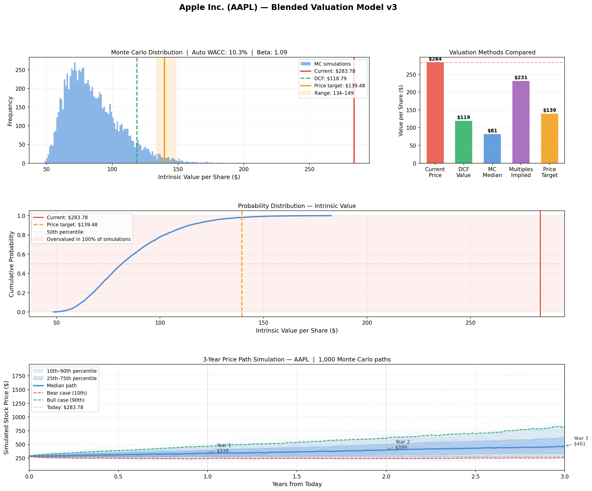

# Stock Valuation Tool

A Python-based stock valuation tool that combines multiple methodologies 
to produce a blended price target and 3-year price forecast for any stock.

## What it does

- **DCF Valuation** — projects free cash flows forward and discounts them 
  back using an automatically calculated WACC
- **Monte Carlo Simulation** — runs 10,000 simulations with randomised 
  growth and discount rate assumptions to model valuation uncertainty
- **Multiples Analysis** — compares the company's P/E and Price/FCF 
  ratios against sector averages to produce a multiples-implied value
- **Blended Price Target** — weights all three methods into a single 
  price target with a confidence range
- **News Sentiment Analysis** — pulls the last 30 days of relevant news 
  headlines via NewsAPI, scores them using TextBlob sentiment analysis, 
  and incorporates the result as a drift adjustment in the price simulation
- **3-Year Price Path Simulation** — uses geometric Brownian motion and 
  3 years of historical price data to simulate 1,000 possible price paths, 
  with year 1, 2, and 3 median, bear, and bull case forecasts

## Example output

## Example output




## Installation

```bash
git clone https://github.com/jayantrathi/valuation-tool
cd valuation-tool
pip install -r requirements.txt
python -m textblob.download_corpora
```

Create a `.env` file in the project folder:


Get a free API key at [newsapi.org](https://newsapi.org/register)

## Usage

```bash
python valuation_v3.py
```

Enter any stock ticker when prompted — AAPL, TSLA, KO, NVDA, MSFT, etc.

## How the blended price target works

| Method | Weight |
|---|---|
| DCF | 35% |
| Monte Carlo | 35% |
| Multiples | 30% |

## Limitations and future improvements

- DCF methodology undervalues hypergrowth companies (e.g. NVDA) whose 
  growth rates exceed the model's assumptions
- TextBlob sentiment analysis reads word-level polarity rather than 
  financial context — a future upgrade would use FinBERT, a sentiment 
  model trained specifically on financial news
- Price path simulation uses historical volatility which assumes future 
  volatility matches the past — this breaks down around major market events
- Model does not account for macroeconomic factors, interest rate changes, 
  or geopolitical risk

## Built with

- [yfinance](https://github.com/ranaroussi/yfinance) — live financial data
- [NewsAPI](https://newsapi.org) — news headlines
- [TextBlob](https://textblob.readthedocs.io) — sentiment analysis
- [NumPy](https://numpy.org) / [Pandas](https://pandas.pydata.org) — data processing
- [Matplotlib](https://matplotlib.org) — visualisation
